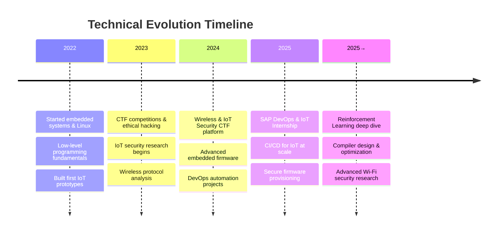

<div align="center">

#  Hello — I'm **Abdelmoemen Kilani**


**`@stringuers`** — Building secure IoT systems, AI prototypes, and full-stack platforms

> _Build secure. Think systems. Break ethically. Ship fast._

[](https://www.linkedin.com/in/abdelmoemen-kilani-030756295/)
[](mailto:kilenimoemen2004@gmail.com)
[](https://github.com/stringuers)


</div>

---

## 🚀 About Me

```python
class AbdelmoemenKilani:
    def __init__(self):
        self.username = "stringuers"
        self.roles = "SAP DevOps & IoT Intern"
        self.education = "Computer Engineering & Embedded Systems"
        self.location = "Tunis, Tunisia 🇹🇳"
        self.languages = ["Python", "C/C++", "JavaScript", "TypeScript", "Java"]
        
    def current_focus(self):
        return [
            "🔐 IoT Security & Wireless Protocols",
            "🤖 Edge AI & TinyML on ESP32",
            "🎯 CTF Platform Development",
            "⚙️ CI/CD & DevOps Automation",
            "🧠 Reinforcement Learning Research"
        ]
    
    def mission(self):
        return """
        Designing practical AI + security solutions for resource-constrained 
        devices, creating gamified training labs (CTFs) to teach wireless & 
        IoT security, and building full-stack tools to help teams ship safer 
        products faster.
        """
```

---

## 🎯 Current Role

<table>
  <tr>
    <td width="60%">
      <h3>💼 SAP DevOps & IoT Intern</h3>
      <ul>
        <li>🔧 Building CI/CD pipelines for IoT device provisioning</li>
        <li>🐳 Containerizing IoT services with Docker & Kubernetes</li>
        <li>🏗️ Infrastructure as Code </li>
        <li>🔒 Implementing secure firmware update mechanisms</li>
        <li>📊 Monitoring & observability for distributed IoT systems</li>
      </ul>
    </td>
    <td width="40%">
      
      
      
    </td>
  </tr>
</table>

---

## 🧰 Tech Stack & Expertise

<div align="center">

### 💻 Languages & Core Skills


### 🔧 IoT & Embedded Systems


### ⚙️ DevOps & Cloud


### 🤖 AI & Machine Learning


### 🌐 Web Development


### 🔐 Security & CTF Tools


</div>

---


## ✨ Featured Projects

<table>
  <tr>
    <td width="50%">
      <h3 align="center">🔐 Wireless & IoT Security CTF</h3>
      <div align="center">
        <a href="https://github.com/stringuers/Wireless_ctf">
          
        </a>
        <p><strong>Gamified CTF platform</strong> for Wi-Fi & IoT security training</p>
        <p>
          
          
          
        </p>
        <p>🎯 Auto-scoring, sandbox isolation, multi-level challenges</p>
      </div>
    </td>
    <td width="50%">
      <h3 align="center">📱 Smart Expense Tracker</h3>
      <div align="center">
        <a href="https://github.com/stringuers/ExpenseTracker">
          
        </a>
        <p><strong>Cross-platform expense management</strong> with AI insights</p>
        <p>
          
          
          
        </p>
        <p>💰 Budget analytics, notifications, ML predictions</p>
      </div>
    </td>
  </tr>
  <tr>
    <td width="50%">
      <h3 align="center">🛠️ CTF Lab Generator</h3>
      <div align="center">
        <a href="https://github.com/stringuers/ctf-lab-gen">
          
        </a>
        <p><strong>Automated challenge builder</strong> for security training</p>
        <p>
          
          
          
        </p>
        <p>🏗️ Multi-difficulty, sandbox builder, auto-deploy</p>
      </div>
    </td>
    <td width="50%">
      <h3 align="center">🤖 Edge AI on ESP32</h3>
      <div align="center">
        <p><strong>TinyML models</strong> running on resource-constrained devices</p>
        <p>
          
          
          
        </p>
        <p>🧠 Real-time inference, model optimization, MQTT integration</p>
        <p><em>Repository coming soon</em></p>
      </div>
    </td>
  </tr>
</table>

---

## 🏆 GitHub Achievements

<div align="center">


</div>

---

## 📈 GitHub Statistics

<div align="center">


</div>

<div align="center">


</div>

---

## 🗺️ My Technical Journey



---

## 💡 What I'm Currently Learning

<div align="center">

| 🎯 Focus Area | 📚 Resources | 🚀 Progress |
|--------------|-------------|------------|
| **Reinforcement Learning** | Sutton & Barto, OpenAI Gym | 75% |
| **Compiler Design** | Dragon Book, LLVM | 60%|
| **Rust for Embedded** | Embedded Rust Book | 70% |
| **Advanced IoT Security** | IoT Pentesting, Wi-Fi Hacking | 85% |
| **Kubernetes at Scale** | CKAD, Production Best Practices | 65% |

</div>

---

## 🎓 Certifications & Achievements

<div align="center">

| 🏅 Achievement | 🏛️ Organization | 📅 Year |
|---------------|----------------|---------|
| **IEEE IIP Treasurer** | IEEE | 2024-2025 |
| **CTF Top 10 Finisher** | Various Platforms | 2023-2024 |
| **SAP DevOps Intern** | SAP | 2025 |
| **Open Source Contributor** | GitHub | Ongoing |

</div>

---

## 📝 Latest Blog Posts & Articles

<!-- BLOG-POST-LIST:START -->
- 🔐 **Securing IoT Devices: A Practical Guide** _(Coming Soon)_
- 🎯 **Building a CTF Platform from Scratch** _(Coming Soon)_
- 🤖 **Running TinyML on ESP32: Lessons Learned** _(Coming Soon)_
- ⚙️ **DevOps for IoT: CI/CD Best Practices** _(Coming Soon)_
<!-- BLOG-POST-LIST:END -->

---

## 🤝 Let's Collaborate On

<div align="center">

| 💼 Area | 🎯 Interests |
|---------|-------------|
| **IoT Security** | Secure firmware, wireless protocol analysis, penetration testing |
| **CTF Development** | Gamified cybersecurity training, challenge creation, automated scoring |
| **Edge AI** | TinyML on microcontrollers, model optimization, real-time inference |
| **DevOps Tooling** | Security automation, CI/CD for embedded, infrastructure as code |
| **Full-Stack Dashboards** | Security monitoring, IoT device management, real-time analytics |

</div>

---

## 🌟 Community & Open Source

<div align="center">

[](https://github.com/stringuers)
[](https://github.com/stringuers)

**Active in:** IEEE, Cybersecurity CTF Communities, Open Source IoT Projects

</div>

---

## 📊 Weekly Development Breakdown

<!--START_SECTION:waka-->
```text
Python       12 hrs 34 mins  ████████████░░░░░░░  45.2%
C/C++        8 hrs 15 mins   ████████░░░░░░░░░░░  29.7%
JavaScript   3 hrs 42 mins   ███░░░░░░░░░░░░░░░░  13.3%
YAML         1 hr 48 mins    █░░░░░░░░░░░░░░░░░░   6.5%
Other        1 hr 28 mins    █░░░░░░░░░░░░░░░░░░   5.3%
```
<!--END_SECTION:waka-->

---

## 📫 Get In Touch

<div align="center">

[](mailto:kilenimoemen2004@gmail.com)
[](https://www.linkedin.com/in/abdelmoemen-kilani-030756295/)
[](https://github.com/stringuers)

**💬 Open to:** Collaborations, Internships, Research Opportunities, Speaking Engagements

**⏰ Timezone:** GMT+1 (Tunis, Tunisia)

**📅 Best time to reach:** Weekdays 9 AM - 6 PM CET

</div>

---

<div align="center">

### 🌟 "Security is not a product, but a process" — Bruce Schneier


---

**Thanks for visiting!** ⭐ Consider starring my repositories if you find them useful!


</div>
